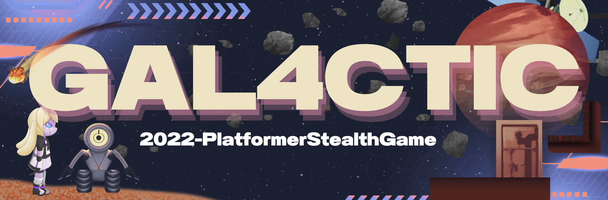

    [![Contributors][contributors-shield]][contributors-url]
    
</a>

    [![Development][unity-shield]][unity-url]
</a>

<!-- MARKDOWN LINKS & IMAGES -->
[contributors-shield]: https://img.shields.io/badge/PlatformerStealthGame-Contributors-%23d3bfff
[contributors-url]: https://github.com/spe-uob/2022-PlatformerStealthGame/graphs/contributors
[build-url]: https://github.com/spe-uob/2022-PlatformerStealthGame/actions/workflows/testing.yml
[unity-shield]: https://img.shields.io/badge/Development-Unity-lightgrey
[unity-url]: https://unity.com/download

## **Project Proposal**
 
 Create a platformer time-based,  stealth like game - where the player must take control of a runaway space ship by fixing problems on each level (problems are fixed  by the player answering multiple choice questions around AI , Cloud etc correctly). Each level will have a different theme - AI, Cloud, Engineering, Automation,  Design Thinking  etc. The Q&A's will be based on the content in the IBM Academic Initiative and Skills Build. For each question the player gets wrong, a defined > amount of time is removed  making the game play more challenging. For every question right  - time is added. If the player does not reach the Bridge of the ship in  the allotted time  - then they lose the game.

## **Learning experiences are to be taken from:**

- <a href="https://skillsbuild.org/" target="_blank">Skills Build</a>
- <a href="https://www.ibm.com/academic/home" target="_blank">IBM Academic Initiative</a>

**Inspiration**
 
> Counterspy.

## **Dev Setup Instructions:**

1.)  Download <a href="https://unity.com/download" target="_blank">**Unity Hub** </a>  
2.)  Through Unity Hub, download the <a href="https://unity.com/releases/editor/archive" target="_blank"> **2021.3.11f1** </a> version of the Unity editor  
3.)  Clone our repository into your desired directory  
4.)  Navigate to **/PlatformerStealthGame** under that directory  
5.)  Open the project in **the Unity editor**  
6.)  **Visual Studio** is suggested as our **preferred IDE**

## **Disclaimer for Windows**
> There are some issues with the Unity editor we used wherein the project might state that it has "compilation errors". This is generally due to the location of your Unity installation being in a directory with space characters in its name. The issue should be resolved if you move the Unity directory to another location.

## **Deployment Instructions:**
_If you've followed the Dev Setup Instructions above..._
- Enter **the Unity Editor** and **select File → Build Settings→ Build**
- **Double click** the build file

_Downloading our game via GitHub actions_
- Enter the [Actions](https://github.com/spe-uob/2022-PlatformerStealthGame/actions) section of our repository
- From the bar on the left-hand-side, click on **"Building and Testing"**
- Click on the most recent **successful** workflow
- Scroll to the bottom of the page to find the **Artifacts**
- Double click on your desired platform, unzip the downloaded file, and enjoy our game!

_Further attention is required when downloading our MacOS version_
- Unzip the downloaded file
- Click on the directory
- Right click on **StandAloneOSX** > Show Package Contents
- Contents > MacOS
- Open a terminal in the current directory
- Type: **chmod +x PlatformerStealthGame**
- Close the terminal
- Double click on **PlatformerStealthGame** and enjoy our game!

## **Download our game here:**
| Version | Download link | Release Date | Size |
| --- | --- | --- | --- |
| Beta release |  <a href="https://github.com/spe-uob/2022-PlatformerStealthGame/releases/tag/beta">Click Here</a> | 22/02/2023 | 75.7 MB |
| Final release | <a href= "https://github.com/spe-uob/2022-PlatformerStealthGame/releases/tag/OfficialRelease"> Click Here</a> | 04/05/2023 | 150 MB |
 

## **User Stories:**
1.)  As **developers**, we want to create a more engaging way to teach Computer Science so that anyone who plays the game is inclined to continue playing it, thus gaining a stronger knowledge of Computer Science related topics as well as revise on any of our lacking subjects.  
2.)  As a **partner** of IBM, we want to create a game that will draw more attention to the valuable resources on IBM's pre-existing platform Skills Build.  
3.)  As **aspiring Computer Scientists**, we want to play a game that will both be creatively challenging and inspiring on our road to learning CS.  
4.)  As an **individual not directly involved with CS**, I'd like to play a game that could perhaps help me find a new area of interest in the CS field.  

## **Stakeholders:**
- Anyone looking to learn some CS!
- The International Business Machines Corporation (IBM)
- Assets and sprites design team
- Basically, everyone...

## **Group Members:**
- Morgan Smith (rq21028)
- Zhuhan Li (od20184)
- Suchanan Unhavaithaya (Pearl) (zc21075)
- Lee Ohana Wing Hee (uv20465)
- Sengul Cagdal (tx21026)

## **Supporting Mentor:**
- Pragya Gurung

## **Documentation**
- <a href="https://github.com/spe-uob/2022-PlatformerStealthGame/projects/1" target="_blank">**Kanban Board** </a>
- <a href="https://github.com/spe-uob/2022-PlatformerStealthGame/tree/main/docs" target="_blank">**Our documents** </a>  

